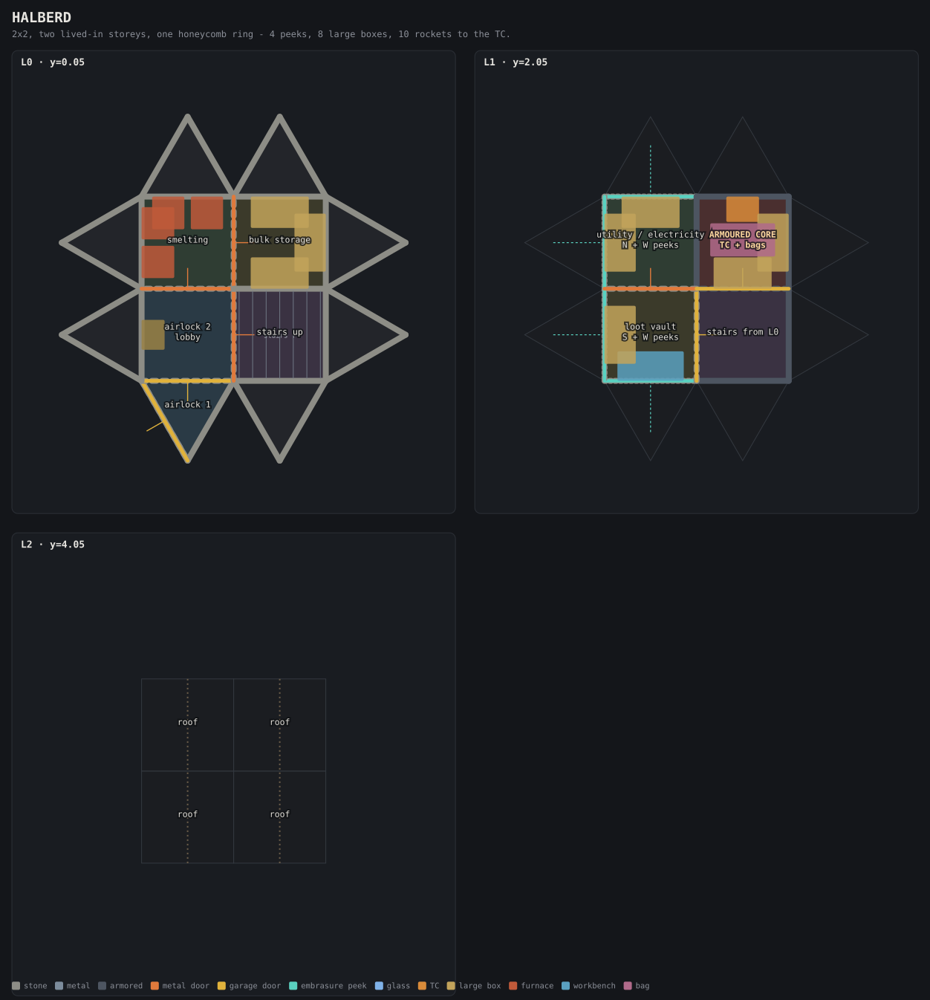
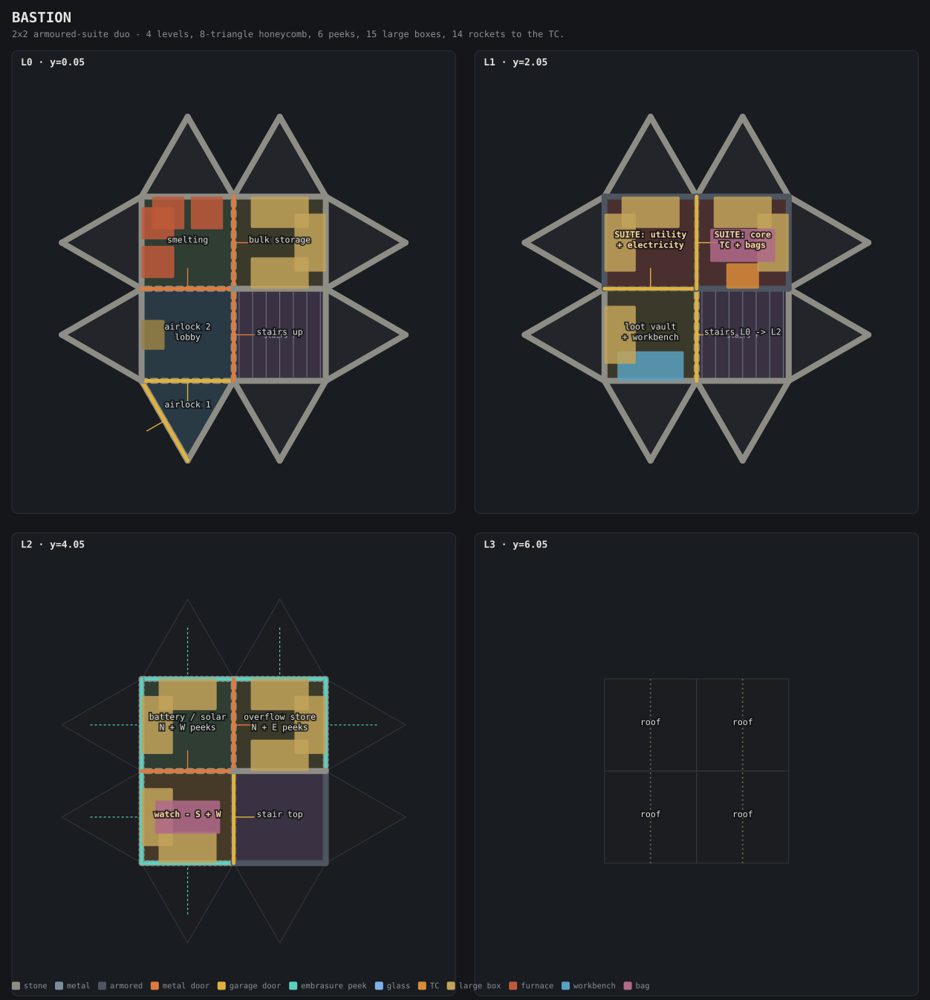
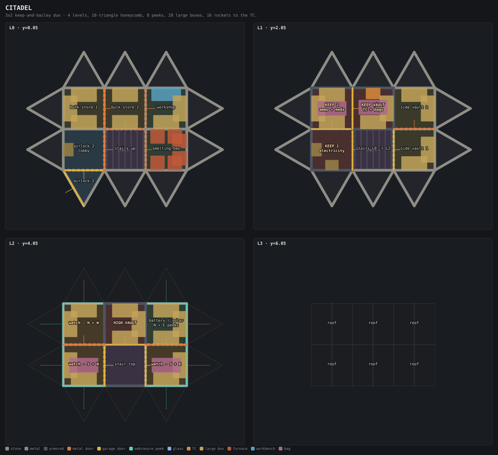
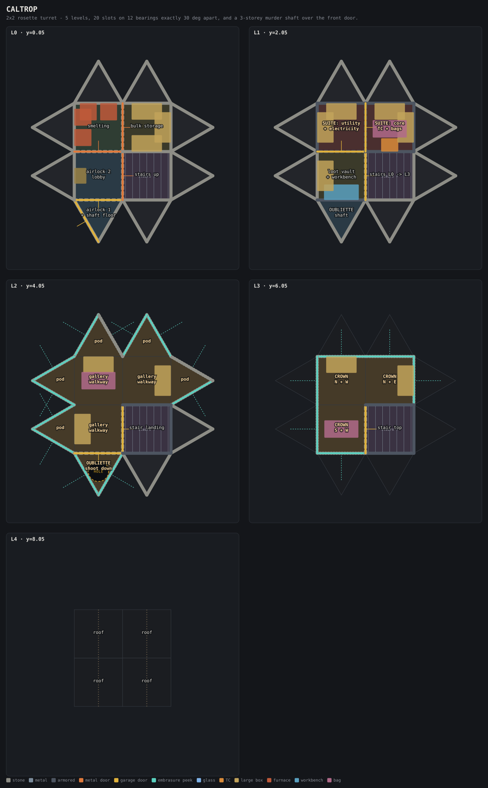

# Duo base designs

Three duo bases built with this repo's builder, plus the toolkit that generated
them. Every design is a real, importable base: the `.txt` files in `out/` are
the exact strings the app's **Import → via code** field takes.

|                                        | HALBERD | BASTION | CITADEL | CALTROP |
| -------------------------------------- | ------: | ------: | ------: | ------: |
| Footprint (foundations)                | 4 + 8 tri | 4 + 8 tri | 6 + 10 tri | 4 + 8 tri |
| Levels                                 | 3 | 4 | 4 | 5 |
| Structural objects                     | 85 | 130 | 177 | 177 |
| Stone                                  | 13,830 | 21,810 | 28,410 | 26,955 |
| Metal frags                            | 2,200 | 3,150 | 4,700 | 4,750 |
| HQM                                    | 177 | 279 | 431 | 391 |
| Wood (twig → wood)                     | 2,659 | 4,193 | 5,595 | 5,291 |
| Upkeep / day (stone)                   | 1,952 | 3,397 | 4,801 | 4,555 |
| **Rockets to the TC**                  | **10** | **14** | **16** | **14** |
| Sulfur to the TC                       | 14,000 | 19,600 | 22,400 | 19,600 |
| Firing slots                           | 4 | 6 | 8 | **20** |
| Distinct firing bearings               | 3 | 4 | 4 | **12** |
| Large boxes placed                     | 8 | 15 | 28 | 13 |
| Unsealed rooms (walk-in)               | 0 | 0 | 0 | 0 |

`build.mjs` prints all of this and writes the base codes and the floor plans:

```
node designs/build.mjs            # all three
node designs/build.mjs bastion    # just one
```

## Importing a design

1. Open the app (`npm run dev`, or <https://krystiandzirba.github.io/Rust-Base-Builder/>).
2. **Import → via code**, paste the contents of `out/<name>.txt`, press **apply**.
3. Toggle **place the base (off → on)** and click the grid to drop it.
4. Toggle it back off.

`out/<name>.txt` is also a valid **Import → via .txt file** upload.

---

## The one idea behind all three

An armoured wall costs a raider 15 rockets. An armoured wall with a garage door
in it costs 3, because nobody shoots the wall when there is a door next to it.
So the useful question is never "how much armour is there" — it is **what is the
cheapest continuous path from the outside to the tool cupboard**, counting doors,
floors, ceilings and honeycomb, and taking the minimum over every route
including through the roof.

`lib/analyze.mjs` builds that graph — every walkable space is a node, every wall,
door, floor and ceiling is a weighted arc, the outside world is one node — and
runs Dijkstra from outside. The number in the table is that shortest path. The
first pass over these designs came back at **7 rockets for all three**, because
each vault door opened onto a room that was one window away from the outside.
Everything below is what that number forced.

Three rules came out of it, and they are what actually make these bases hold:

1. **A vault is worth what its cheapest door costs, plus the depth of the room
   that door opens into.** Armour on the vault's own walls only matters once the
   door route is longer than 15 rockets.
2. **Every door on the loot path is a garage door.** 3 rockets and 9 satchels,
   versus 2 and 4 for a metal door. Over a four-door chain that is +4 rockets for
   1,200 metal frags.
3. **A stair shaft is a hole in your defence.** The cell a staircase climbs
   through has no floor, so it is a free vertical corridor. Its outward walls and
   its cap get armoured, and it never touches the vault — the wall between the
   spine and the vault is armoured with no opening in it.

### What the numbers assume

- Rocket counts are the app's own `RaidCalculator` table (stone 4, metal 8,
  armoured 15, metal door 2, garage door 3), mirrored in `lib/catalog.mjs`.
- Sulfur is 1,400 per rocket, crafted from raw sulfur, which is the app's
  "count sub-ingredients" mode.
- A raider is assumed to always take the cheapest route. Real raids are worse at
  this than Dijkstra is, so treat these as floors, not estimates.
- Soft-side raiding, external TCs, ladders and boosting are not modelled. Neither
  is the thing that actually stops most raids: someone shooting back out of an
  embrasure.

---

## HALBERD — the day-two base



**13,830 stone · 177 HQM · 10 rockets to the TC · ~1,950 stone/day upkeep**

A 2×2 core with a single ring of eight honeycomb triangles, two lived-in storeys
and a sealed cap. This is what you put up on the first or second day and never
have to demolish — its footprint is identical to BASTION, so the upgrade is
additive.

| Level | Rooms |
| ----- | ----- |
| L0 | airlock triangle → lobby, stair spine, smelting (4 furnaces), bulk storage |
| L1 | loot vault + workbench (S/W peeks), utility & electricity (N/W peeks), **armoured core: TC + bags** |
| L2 | sealed cap, gable roof |

The honeycomb is one storey tall and the L1 floor triangles cap it into a skirt
roof. That means L1's own walls face straight outwards — which is free, because a
stone window and a stone wall both cost 4 rockets. So all four L1 peeks cost
nothing in raid resistance, and two of them look straight down onto the front
door.

The core is cell D: four armoured walls, an armoured floor, an armoured ceiling,
and one garage door that opens onto the **stair shaft**, not onto a room with a
window in it. The shaft's own outward walls and its cap are armoured too. The
cheapest way in is window (4) → garage (3) → garage (3).

## BASTION — the recommended build



**21,810 stone · 279 HQM · 14 rockets to the TC · ~3,400 stone/day upkeep**

Same 2×2 footprint, but the honeycomb ring now runs two storeys and there is a
dedicated watch floor on top. This is the one to build if you are picking one.

| Level | Rooms |
| ----- | ----- |
| L0 | airlock triangle → lobby, stair spine, smelting (4 furnaces), bulk storage |
| L1 | loot vault + workbench, **armoured suite: utility/electricity + core with the TC** |
| L2 | watch floor — six embrasures covering all four sides, battery room, overflow store |
| L3 | sealed cap, gable roof |

The suite is two cells (C and D on L1) inside one armoured envelope: armoured
walls all round, an armoured slab underneath, an armoured slab over the top. It
cannot be splashed from the storey above or below, and it has exactly two doors
in series — vault → utility → core — both garage doors, with the spine walled off
from the core by an armoured wall that has no opening.

The binding route is not a door route at all. It is **honeycomb (4) → core-block
wall (4) → garage (3) → garage (3)**: the shell sets the price, which is what you
want. Every shortcut — the shaft, the roof, the L2 windows — has been closed to
at least that cost.

L2 is deliberately the cheap floor. It is 4 rockets from outside, it holds the
peeks and the electricity, and nothing valuable lives there. It exists to eat the
first breach and to let you shoot at whoever made it: the honeycomb roof below it
is a walkable skirt, and every embrasure on L2 looks down onto it.

## CITADEL — late wipe



**28,410 stone · 431 HQM · 16 rockets to the TC · ~4,800 stone/day upkeep**

Three cells wide instead of two, which buys one specific thing: on a 3×2 grid the
two middle cells touch the outside on **exactly one edge each**. One becomes the
stair spine, the other becomes the vault column. Neither can be reached by
breaking two walls in a straight line.

| Level | Rooms |
| ----- | ----- |
| L0 | airlock → lobby, spine, smelting bay (6 furnaces), two bulk stores, workshop |
| L1 | two stone side vaults + **three-cell armoured keep: electricity → ammo/meds → vault with the TC** |
| L2 | watch gallery (8 embrasures), high vault, battery/solar room |
| L3 | sealed cap, gable roof |

The keep is A → D → E on L1, three garage doors in series inside one armoured
envelope, and the loot is split three ways on three separate door chains:

| What | Rockets |
| ---- | ------: |
| L2 battery room | 4 |
| L0 stores, workshop, smelting | 8 |
| L1 side vaults | 8 |
| L2 high vault | 10 |
| keep, chamber 1 | 10 |
| keep, chamber 2 | 13 |
| **keep vault (TC)** | **16** |

That gradient is the point. A raider who commits 8 rockets gets farm. To get the
guns they have to commit twice that, from inside, while eight embrasures look at
them. Put explosives and weapons in the keep, components in the side vaults, and
farm on the ground.

Do not start this base before you can hold the stone bill plus ~450 HQM. The
layout does not change if you build the shell in stone and upgrade the keep
later, which is the sane way to do it.

---

## Repository layout

```
designs/
  build.mjs            generate codes, plans and the report
  bases/               one file per design, read top to bottom
  lib/
    geometry.mjs       grid maths (verified against the shipped .glb bounds)
    catalog.mjs        model names + cost tables mirrored from the app
    base.mjs           declarative builder
    analyze.mjs        seal check + raid pathing
    plan.mjs           SVG floor plans
    exporter.mjs       the app's deflate + base64 base code
  out/                 base codes (import these) + report.json
  plans/               floor plans, one panel per storey
```

### How the geometry was pinned down

Nothing here is guessed. The conventions in `lib/geometry.mjs` were read off the
shipped models' bounding boxes and cross-checked against the prebuilt bases in
`src/components/script/PrebuiltBasesData.tsx`:

- one foundation is **2 world units**; a triangle's origin is the **midpoint of
  its base edge**, apex 1.732 along its facing
- a wall is 2 × 2 with its origin at the bottom centre; a storey is 2 units
- low / mid / high foundations top out at y = 0.05 / 1.05 / 2.05, so a storey
  sits at `y = 0.05 + 2k`
- roof pieces rise 2 over their span from the low edge at the origin, so a
  gable is two rows facing opposite ways
- rotation is the Euler `_y` in radians, measured clockwise from +Z

All three designs were loaded back into the running app to confirm the object
counts and the materials land where the plans say they do.

### Two caveats worth knowing

- **Box density.** The app's deployable models are about 35% oversized against
  its own 2-unit foundation, so the plans fit one large box per wall where the
  game fits two. Read the box counts as layout, not capacity.
- **No pixel gaps.** The builder cannot yet place pixel-gap or wide-gap
  structures, so none of these designs contain a true bunker. The armoured
  suite/keep is the strongest thing this toolset can express.

---

## CALTROP — the rosette turret



**26,955 stone · 391 HQM · 14 rockets to the TC · ~4,550 stone/day upkeep**

A caltrop always has a spike pointing at you, whichever way it lands. That is
the whole design: **20 firing slots on 12 bearings exactly 30° apart, with no
gap anywhere on the compass and every bearing covered from two different
heights.**

### The rosette

The trick is that triangles and squares fire at angles that cannot overlap.

A triangle hangs off a square edge, so its two slant faces sit at ±60° from that
edge's bearing — **30, 60, 120, 150, 210, 240, 300, 330**. The square's own
faces sit on the cardinals — **0, 90, 180, 270**. Neither set touches the other.
So put one firing ring on the triangles and another on the square, one storey
apart, and the union is a perfect 30° rosette:

| Ring | Level | Slots | Bearings |
| ---- | ----- | ----: | -------- |
| Gallery (triangle pods) | L2 | 14 (12 embrasure + 2 glass) | 30, 60, 120, 150, 210, 240, 300, 330 |
| Crown (block faces) | L3 | 6 embrasure | 0, 90, 180, 270 |
| **Union** | | **20** | **12 bearings, every gap exactly 30°** |

`node designs/build.mjs` re-derives that from the exported base, so it is a
checked property of the geometry, not a claim about it. Break the crown's line
of sight by hugging a rock and the gallery two metres below still has you.

The gallery is one continuous star-shaped room — six triangle pods opening
straight onto the walkway, no doors between them — so one player walks a ring
and never opens anything to change angle. The crown is a single open drum you
pivot inside. The two triangles hanging off the stair spine stay sealed
honeycomb: opening them would sell the spine for four rockets.

### The oubliette

The airlock triangle gets **no ceiling on L1 or L2** and a floor frame at the
top. That makes it a three-storey stone shaft with your own front door at the
bottom of it. Blow the outer garage and you are standing in a 3 × 3 m tube being
shot at from directly overhead, with nothing to build on inside the TC radius.

It costs the base nothing. The pod sits behind its own garage door, so the
gallery is four rockets whether the shaft is there or not.

It did cost one wall, though, and the analyser is what found it. The shaft runs
up the inside of the honeycomb, so on L1 it shares a wall with the loot vault —
and that wall used to be stone. Outer garage (3) plus one stone wall (4) was a
**seven-rocket bypass straight into the vault**, skipping the whole door chain.
Armouring that single wall — 25 HQM — put it back to 14.

| Room | Rockets |
| ---- | ------: |
| L0 smelting, bulk storage | 8 |
| L1 loot vault | 8 |
| L1 suite: utility / electricity | 11 |
| **L1 suite: core (TC)** | **14** |

Same number as BASTION on the same footprint, and the binding route is still the
shell — honeycomb (4) → core wall (4) → garage (3) → garage (3) — not a
shortcut. The two firing floors are sacrificial and hold ammo; the TC never
leaves the armoured suite under its armoured lid.

### Cost of the flex

18 embrasures, 2 glass, a third storey of honeycomb, a fourth staircase and a
five-level spine put this at CITADEL money on a 2 × 2 footprint. It buys no
extra storage — 13 large boxes against CITADEL's 28. What it buys is that
nobody gets to approach from an angle you are not already looking down.
